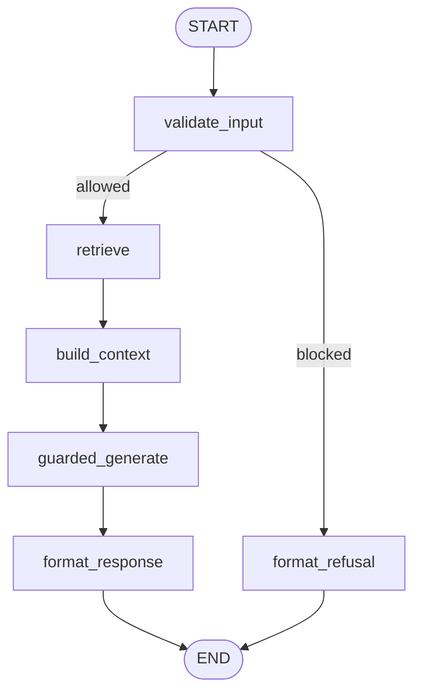

# Work RAG Orchestrator

LangGraph orchestration and public chat API for the Work Credit RAG platform.

> **Status:** ✅ **IMPLEMENTED AND LIVE** on Vast.ai (`vast-gemma4-migration`, commit `cdb6e7d`). The runtime described below matches the deployed system.

## Responsibility

This component owns request coordination. It does not own KB maintenance/retrieval algorithms, NeMo policy definitions, model lifecycle, or the frontend.

The MVP graph is deterministic:



- `validate_input` → calls Work RAG Guardrails `/v1/rails/check` (stage=input)
- `retrieve` → calls Work RAG KB `/search/api`
- `guarded_generate` → calls Guardrails `/v1/chat/completions` (which calls Gemma :18000)
- `format_response` → builds citation-shaped OpenAI-compatible response

## API Contract

| Method | Path | Purpose |
|--------|------|---------|
| `GET` | `/health` | Process health |
| `GET` | `/ready` | Dependency readiness (KB + Guardrails) |
| `POST` | `/v1/chat/completions` | OpenAI-compatible non-streaming chat entry point |

### Request

```json
{
  "model": "gemma-4-31b",
  "messages": [{"role": "user", "content": "اعتبارسنجی چیست؟"}],
  "temperature": 0,
  "max_tokens": 512
}
```

Headers: `X-Request-ID` (optional, auto-generated if absent)

### Response

```json
{
  "id": "chatcmpl-...",
  "object": "chat.completion",
  "model": "gemma-4-31b",
  "choices": [{
    "index": 0,
    "message": {"role": "assistant", "content": "..."},
    "finish_reason": "stop"
  }],
  "rag": {"citations": 5}
}
```

If blocked: `finish_reason: "content_filter"`, `rag.citations: 0`

## Configuration

| Variable | Default | Production |
|----------|---------|------------|
| `KB_BASE_URL` | `http://127.0.0.1:8000` | `http://127.0.0.1:8000` |
| `GUARDRAILS_BASE_URL` | `http://127.0.0.1:8200` | `http://127.0.0.1:8200` |
| `LANGFUSE_HOST` | `http://127.0.0.1:3000` | `http://127.0.0.1:3001` |
| `LANGFUSE_PUBLIC_KEY` | `pk-lf-mvp-local` | from `/tmp/opencode/langfuse.env` |
| `LANGFUSE_SECRET_KEY` | `sk-lf-mvp-local` | from `/tmp/opencode/langfuse.env` |
| `TRACE_ENABLED` | `true` | `true` |
| `UPSTREAM_LLM_MODEL` | `gemma-4-31b` | `unsloth/gemma-4-31B-it-GGUF:UD-Q4_K_XL` |

## Graph Nodes

| Node | File | Purpose |
|------|------|---------|
| `validate_input` | `nodes/validate_input.py` | Guardrails input check |
| `retrieve` | `nodes/retrieve.py` | KB search + query rewrite |
| `build_context` | `nodes/build_context.py` | Context construction (MAX_CHUNKS=5, MAX_CONTEXT_CHARS=6000) |
| `guarded_generate` | `nodes/guarded_generate.py` | Guardrails generation gateway |
| `format_response` | `nodes/format_response.py` | Citation shaping, refusal handling |
| `format_refusal` | `nodes/format_response.py` | Reuses format_response for blocked |

## State Schema (RAGState)

```python
class RAGState(TypedDict):
    request_id: str
    messages: list[dict[str, str]]
    query: str
    rewritten_query: str
    guardrail_decision: dict
    retrieved_chunks: list[dict]
    prompt_messages: list[dict[str, str]]
    answer: str
    citations: list[dict]
    blocked: bool
    error: str | None
```

## Tracing (Langfuse)

Every request creates a trace keyed by `X-Request-ID` with spans:

```
trace-create (input)
├── validate_input
├── query-rewrite (if multi-turn)
├── retrieve
├── build_context
├── guarded_generate
├── format_response
└── trace-create upsert (output, metadata{citations, latency_ms, finish_reason})
```

View: `GET http://127.0.0.1:3000/observe/{request_id}` or Langfuse UI :3001

## Local Graph Debugger

```bash
# Terminal 1: Start Studio API
bash deploy/vast/studio.sh  # API on :2024

# Terminal 2: Open local viewer (no Smith panel needed)
open http://127.0.0.1:3000/studio

# Or use Smith panel (needs tunnel -L 2024:localhost:2024)
open https://smith.langchain.com/studio/?baseUrl=http://127.0.0.1:2024
```

**Run input MUST include `request_id`:**
```json
{"request_id": "studio-001", "messages": [{"role": "user", "content": "سلام"}]}
```

## Project Structure

```
components/orchestrator/
├── README.md
├── STUDIO.md                 # Studio usage guide
├── pyproject.toml
├── langgraph.json            # Studio config: {"graphs": {"rag": "./studio_graph.py:graph"}}
├── src/work_rag_orchestrator/
│   ├── api.py                # FastAPI app, /health, /ready, /v1/chat/completions
│   ├── config.py             # Pydantic settings
│   ├── graph.py              # LangGraph definition (5 nodes + conditional)
│   ├── state.py              # RAGState TypedDict
│   ├── schemas.py            # Request/Response Pydantic models
│   ├── tracing.py            # Langfuse direct-HTTP + SDK fallback
│   ├── rewrite.py            # Query rewrite + history helpers
│   ├── nodes/
│   │   ├── validate_input.py
│   │   ├── retrieve.py
│   │   ├── build_context.py
│   │   ├── guarded_generate.py
│   │   └── format_response.py
│   └── clients/
│       ├── guardrails.py     # HTTP client for Guardrails
│       └── knowledgebase.py  # HTTP client for KB Manager
└── tests/
    ├── test_memory_coref.py
    └── ...
```

## Running Locally

```bash
cd components/orchestrator
PYTHONPATH=./src \
KB_BASE_URL=http://127.0.0.1:8000 \
GUARDRAILS_BASE_URL=http://127.0.0.1:8200 \
LANGFUSE_HOST=http://127.0.0.1:3001 \
LANGFUSE_PUBLIC_KEY=... LANGFUSE_SECRET_KEY=... \
/tmp/orch-venv/bin/python -m uvicorn work_rag_orchestrator.api:create_app --factory --host 0.0.0.0 --port 8100
```

## Tests

```bash
cd components/orchestrator
PYTHONPATH=./src /tmp/orch-venv/bin/python -m pytest tests/ -v
```

## Links

- [Parent README](../README.md)
- [Architecture](docs/architecture.md)
- [Models](docs/models.md)
- [STUDIO.md](STUDIO.md) — local graph debugger guide
- [MVP Integration Plan](../docs/MVP_INTEGRATION_PLAN.md)